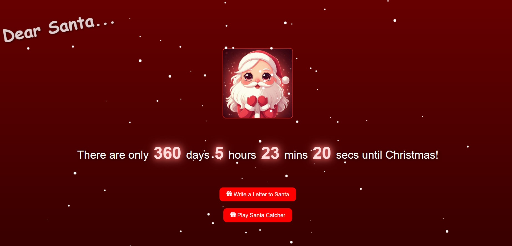
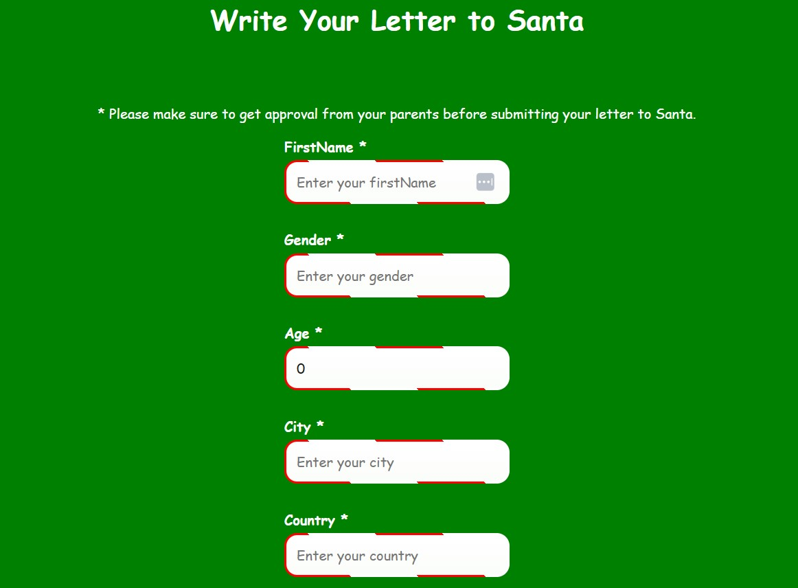
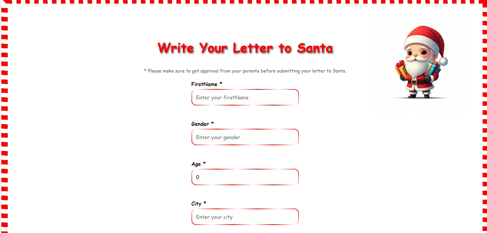
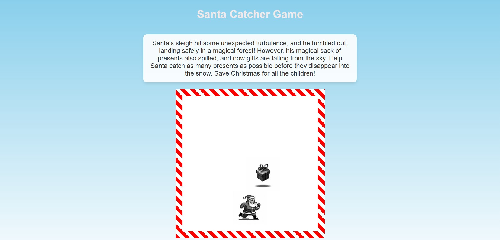

# 🎅 **SantaMail** 🎄  

Author: Eliza Fury

---

## **Welcome to SantaMail!**  

SantaMail is a cozy little project I worked on leading up to Christmas, inspired by the joy of the holiday season! With SantaMail, you can send a Christmas message straight to Santa using **Nodemailer**. It features a cheery **frontend** and a robust **backend**, all working together to spread seasonal joy. 🎁  

---

## **What You’ll Need**  

Before you get started, make sure your sleigh is ready with the following:  

- 🛠️ **Node.js**: To run the React frontend.  
- 🖥️ **.NET Core SDK**: To build and run the backend.  
- 🎀 **Yarn** (or **npm**): For managing frontend dependencies.  
- 📧 **Gmail Account**: You’ll need to connect a Gmail account and authorize the app to send messages.  

---

## **Setting Up SantaMail**  

Here’s how to get SantaMail up and running faster than Rudolph on Christmas Eve:  

1. **Clone the Repository**:  
   ```bash
   git clone https://github.com/username/SantaMessage.git
   cd SantaMessager
   ```  

2. **Install Frontend Dependencies**:  
   ```bash
   cd frontend
   yarn install
   ```  

3. **Install Backend Dependencies**:  
   ```bash
   cd ../backend
   yarn install
   ```  

4. **Set Up Environment Variables**:  
   Create an `.env` file in the backend directory with these details:  
   ```plaintext
   GMAIL_USER=your-email@gmail.com
   GMAIL_PASS=your-app-password
   ```  
   ✨ **Important:** You must enable "Allow less secure apps" in your Gmail settings or set up an **App Password** for your Gmail account.  

---

## **Run SantaMail!** 🎉  

Now the magic begins! Follow these steps:  

1. **Start the Backend**:  
   ```bash
   cd backend
   node server.js
   ```  

2. **Start the Frontend**:  
   ```bash
   cd ../frontend
   yarn start
   ```  

3. **Spread the Cheer**:  
   Open your browser and visit **[http://localhost:3000](http://localhost:3000)** to start writing letters to Santa!  

---

## **Features You'll Love**  

🎅 **Homepage**: A festive landing page to get you in the holiday spirit.  
  

💌 **Write a Letter**: Type your heartfelt wishes to Santa.  
  

📧 **Send the Email**: Deliver your letter directly to Santa's inbox via Gmail.  
  

🎮 **Santa Catcher Game**: Have some fun while you wait for Santa's reply!  
  

---

## **Developer Goodies**  

### 🚀 **Quick Coding Tips**  

- Use **ES7 React/Redux/GraphQL/React-Native snippets** for easy component creation (`rfc`, `rcc`), hooks (`useState`, `useEffect`), and more.  
- Combine logic and UI effortlessly with **JSX**.  

### 🧹 **Keep It Tidy**  

Run **ESLint** to keep your code clean and bug-free:  
```bash
yarn lint
```  

---

## **Troubleshooting Tips**  

🎄 **Having trouble with the backend?**  

Make sure to set the required Node.js environment variable:  
```bash
set NODE_OPTIONS=--openssl-legacy-provider
```  

---

## **Want to Help Make SantaMail Even Better?** 🎅✨  

1. Fork the repository and create a branch for your feature:  
   ```bash
   git checkout -b feature/your-feature
   ```  

2. Commit your changes:  
   ```bash
   git commit -m "Add your feature"
   ```  

3. Push your branch:  
   ```bash
   git push origin feature/your-feature
   ```  

4. Open a pull request and share your festive magic with the world!  

---

## **License**  

SantaMail is licensed under the **MIT License**. Check out the `LICENSE` file for all the details.  

This project was a joy to create, and I hope it brings a little extra cheer to your holiday season. Happy coding and may your Christmas be merry and bright! 🎄✨  
